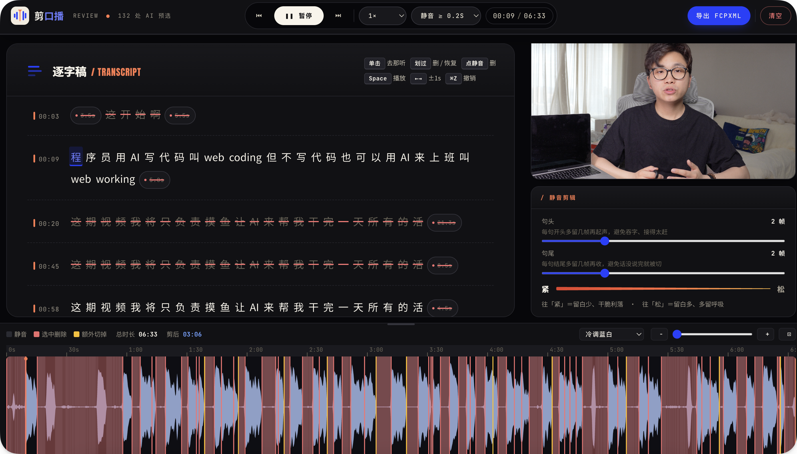

# AI剪口播

一个**剪口播视频的 coding-agent skill**:自动转录 → 识别口误/口癖/静音 → 网页波形审核 → 导出 FCPXML,拖进剪映或 Final Cut Pro 完成最后一刀。核心是一份 [`SKILL.md`](SKILL.md),**任何支持 skill、能读文件、能跑 shell 的 coding agent 都能装来用**,不绑定特定工具。



> 审核网页:左侧逐字稿点划即删,中上方播放/参数,右侧调静音留白,底部三色波形(灰=静音、红=选中删除、黄=算法额外切掉)。改到满意点「导出 FCPXML」。

## 这个 Skill 做什么

口播视频最费时的不是剪,是**找哪里该删** —— 重复重说、卡顿、口癖、长停顿。AI剪口播 把这步交给 agent:转录全文、标出该删的片段,再起一个**本地审核网页**,让你在波形上一眼看清「真正会切到哪一帧」(红=删、黄=算法补切、灰=静音),所见即所得。

它**不直接剪视频**,只把「哪里该删」想清楚,生成剪辑工程文件(FCPXML)交给专业软件做最后一步。无云端、无账号、无第三方图床 —— 音频 base64 直传火山引擎转录,剩下全在你本机跑。

### 主要特性

- **AI 标口误** — 重复重说、残句、句内卡顿、纯语气词整句,自动预选出来等你确认
- **波形审核网页** — 自绘 canvas 波形,长视频也顺滑;删除/补切/静音三色叠加,所见即所得
- **真 WYSIWYG** — 前后端共用同一份切割算法,预览到哪一帧,导出就是哪一帧,不漂移
- **剪映 / FCP 通吃** — 导出的 FCPXML 1.8 一个文件同时被剪映专业版和 Final Cut Pro 识别
- **自进化学习** — 说一句「学一下」,它从你这次的真实剪辑里抽规则,沉淀成你的个人偏好
- **100% 本机** — 视频和音频不经任何第三方存储,key 只在本地
- **跨平台自检** — 一条命令逐项告诉你缺什么、怎么补(Windows / macOS / Linux)

## 安装

把这个仓库地址发给你的 coding agent,说一句 **「装一下」**:

```text
https://github.com/lcbuaaliu/ai-jian-koubo
```

agent 会读 README,自己把它装到本地 skills 目录、配好环境、跑一遍自检,约 1 分钟。有文件系统权限的 agent 直接帮你装好;没有的话,也能在当前会话里照 [`SKILL.md`](SKILL.md) 直接跑一遍。

唯一需要你**亲自做**的一步:办一个**火山引擎 API Key**(语音转录用,共 **40h 免费额度**,完全够用)。装的时候 agent 会引导你把 key 填进去。

### 办火山引擎 API Key(约 2 分钟)

1. 打开并登录**火山引擎 · 豆包语音服务**控制台:
   [console.volcengine.com/speech](https://console.volcengine.com/speech/new/overview)
2. 点左侧 **语音识别**,开通 **「录音文件识别 1.0」** —— **标准版**和**极速版都开通**(各 20h、共 40h 免费额度,独立抵扣)。
3. 点左侧 **API Key 管理**,**复制你的 API Key**。
4. 把 key 发给 agent,它会帮你写进 `~/.claude/skills/.env`。也可以自己写:
   ```bash
   echo "VOLCENGINE_API_KEY=粘贴你的key" >> ~/.claude/skills/.env
   ```

> 默认两个引擎轮流用、吃满 ≈40h;只想用一个就在转录时加 `--flash`(极速版)或 `--v3-standard`(标准版)。

## 使用

装好后,在 agent 里直接说:

```text
帮我剪这个口播视频 /path/to/video.mp4
```

agent 会按 [`SKILL.md`](SKILL.md) 的流程跑:

1. 抽音频 → 火山引擎转录成字级字幕
2. 读全文,标出口误 / 口癖 / 残句,预选要删的片段
3. 起一个本地审核网页,波形三色标注真正会切到哪一帧
4. 你勾选确认 → 点「导出 FCPXML」
5. 把生成的 `*_cut.fcpxml` 拖进剪映 / Final Cut Pro,完成最终剪辑

它还有个**转字幕模式** —— 说「把这个视频转成字幕」,会输出规范的字幕文本(无时间戳的 markdown)。

## 工作原理

这个 skill 用**渐进式披露**:主入口 [`SKILL.md`](SKILL.md) 是一张工作流地图,其它文件按需加载。

| 文件 | 作用 | 何时加载 |
|------|------|----------|
| `SKILL.md` | 核心工作流与规则 | 始终(skill 触发时) |
| `scripts/run_transcribe.sh` | 抽音频 + 火山引擎 ASR | 步骤 1-4(转录) |
| `scripts/gen_analysis.js` | 生成口误分析的纯文本输入 | 步骤 5(分析) |
| `scripts/merge_selections.js` | 句号选择 → 词级 idx 展开 | 步骤 5(合并) |
| `scripts/generate_review.js` | 生成审核网页 | 步骤 6(审核) |
| `scripts/review_server.js` | 审核服务器 + `/api/fcpxml` 导出 | 步骤 7(审核) |
| `scripts/lib/compute_keeps.js` | 切割算法(前后端共用的唯一来源) | 预览与导出 |
| `scripts/doctor.js` | 跨平台环境自检 | 首次安装 |
| `用户习惯/*.md` | 口误判断规则 / 个人偏好 | 步骤 5(分析) |

**切割算法只有一份**(`compute_keeps.js`,UMD 模块):服务器生成 FCPXML 和前端波形预览复用同一份代码,保证「预览到哪一帧,导出就是哪一帧」。导出格式是 **FCPXML 1.8**,剪映专业版(文件 → 导入 → Final Cut Pro XML)和 Final Cut Pro 都能识别。

## 依赖要求

- 一个支持 skill、有文件系统访问、能跑 shell 命令的 coding agent(不绑定特定工具)
- `node` · `python3` · `ffmpeg` · `curl`(`doctor.js` 会按平台给安装命令)
- 一个[火山引擎](https://console.volcengine.com/speech/new/setting/apikeys)账号(用于语音转录,有免费额度)

## 隐私

`.env`(你的 key)被 `.gitignore` 忽略,不会进仓库。音频默认走 base64 直传火山引擎,不经任何第三方图床。

## 致谢

由 **栗氪聊AI** 创建。

## License

[MIT](LICENSE) — 随便用、改、分发。
